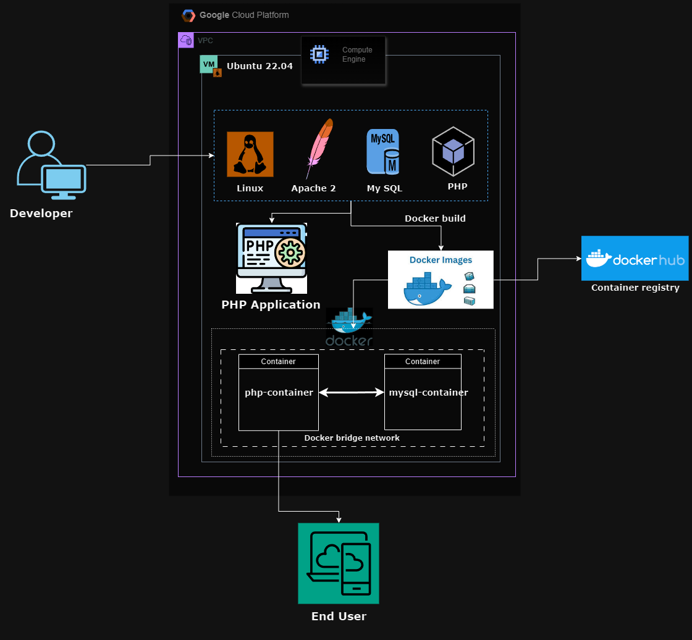

### PHP application using LAMP stack

# Project Description: Full-Stack Application with Monitoring and Security Scanning on GCP

#### todo-php-app
### Project Architecture:

### Project Overview
This project involves the development, deployment, and monitoring of a full-stack web application using Docker containers for the LAMP stack (Linux, Apache, MySQL, PHP) hosted on Google Cloud Platform (GCP) virtual machines (VMs). The project integrates Prometheus for monitoring, Grafana for visualization, and Trivy for vulnerability and security scanning, ensuring a robust, secure, and scalable infrastructure.
#### Objectives
-	Deploy a Dockerized LAMP stack on a GCP VM to host a PHP application with MySQL as the backend.
-	Implement monitoring using Prometheus to track the performance and health of the application and infrastructure.
-	Utilize Grafana for visualization of metrics collected by Prometheus.
-	Integrate Trivy for security and vulnerability scanning of the Docker images used in the project.
-	Ensure Docker container logs are preserved across container restarts using Docker volumes.

#### Architecture
The architecture comprises two primary GCP VM instances within a Virtual Private Cloud (VPC), configured for secure and efficient communication.

App Server (GCP VM):

-	Operating System: Ubuntu 22.04
-	Dockerized LAMP Stack:
-	Docker: Containerization platform.
-	Apache: Web server to serve the PHP application.
-	MySQL: Relational database for data persistence.
-	PHP: Server-side scripting language for dynamic web content.
-	Node Exporter: Collects and exposes hardware and OS metrics.

Monitoring Server (GCP VM):

-	Prometheus: Monitoring system and time-series database.
-	Grafana: Visualization platform that queries and displays metrics from Prometheus.
-	Scraping: Prometheus scrapes metrics from Node Exporter on the App Server.
Detailed Steps

1. Setting Up the Dockerized LAMP Stack
-	Provision the GCP VM:
-	Create a VM instance with Ubuntu 22.04.
-	Configure network settings to allow HTTP (port 80) and HTTPS (port 443).
-	Install Docker
-	Create Dockerfile for PHP Application:

-	Create a docker-compose.yml file to define services for PHP and MySQL:
-	Ensure that the PHP application can communicate with the MySQL backend and is hosted by Apache 2.

2. Setting Up Monitoring
-	Install Prometheus.
-	Configure Prometheus.
-	Edit the prometheus.yml file to add a scrape target.
-	Start Prometheus.

3. Security and Vulnerability Scanning with Trivy
-	Install Trivy.
-	Run Trivy Scan.
-	Scan the Docker image with Trivy.
4. Security and Configuration
-	Network Configuration: Set up firewall rules to allow traffic on necessary ports (80,443, 9090 for Prometheus).
-	Secure MySQL: Use strong passwords and limit remote access.
-	Secure Prometheus: Implement basic authentication or integrate with OAuth for securing Prometheus access.
5. Testing and Validation
-	Access the PHP Application.
-   Open a web browser and navigate to the App Server's public IP.
-	Access Prometheus Dashboard.
-	Open a web browser and navigate to the Monitoring Server's public IP on port 9090.
-	Create Prometheus Queries.
-	Configure Prometheus alerting rules and integrate with alerting tools like Alertmanager.
-	Review Trivy Scan Results.
-	Analyze the output of the Trivy scan to identify and address any vulnerabilities.

#### Conclusion
This project successfully demonstrates the deployment of a full-stack PHP application using Docker containers, integrated with Prometheus monitoring and Trivy for security and vulnerability scanning. By leveraging GCP VMs and Docker, the architecture ensures scalability, reliability, and maintainability, while also prioritizing security and performance monitoring.

#### Resources and Reference Used:
-	Draw.io: https://app.diagrams.net/
-	Get started with Grafana and Prometheus: https://grafana.com/docs/grafana/latest/getting-started/get-started-grafana-prometheus/
-	Trivy installation: https://github.com/aquasecurity/trivy
-	How to make a Todo App using PHP & MySQL?: https://www.geeksforgeeks.org/how-to-make-a-todo-app-using-php-mysql/
-	Tutorial: Install a LAMP server on AL2: https://docs.aws.amazon.com/linux/al2/ug/ec2-lamp-amazon-linux-2.html

Find a link for video of project demonstration here: https://drive.google.com/file/d/1hjuzmIc2yLFlMIZtv9HSfxBmcdA35hIb/view?usp=sharing

Find my portfolio here: https://www.prajwal.site/

